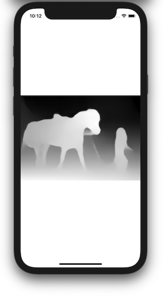

# ailia-xcode

Project sample of ailia SDK for xcode

## Build environment

Xcode 11.3

## Setup

Download u2net_opset11.onnx and midas_v21_small.onnx to ./u2net folder.

```
wget https://storage.googleapis.com/ailia-models/u2net/u2net_opset11.onnx
wget https://storage.googleapis.com/ailia-models/midas/midas_v2.1_small.onnx
```

Download libailia.a from [trial version of ailia SDK](https://ailia.jp/en/).
Put libailia.a to ./u2net folder.

Expected Layout

```
./u2net.xcodeproj
./u2net/libailia.a
./u2net/u2net_opset11.onnx
./u2net/u2net_opset11.prototxt
./u2net/midas_v21_small.onnx
./u2net/midas_v21_small.prototxt
```

## Function

Perform background removal using u2net. (#ifndef MIDAS)


Perform depth estimation using midas. (#ifdef MIDAS)



## Implementation Detail

ailia SDK was implemented in [ViewController.mm](./u2net/ViewController.mm).
